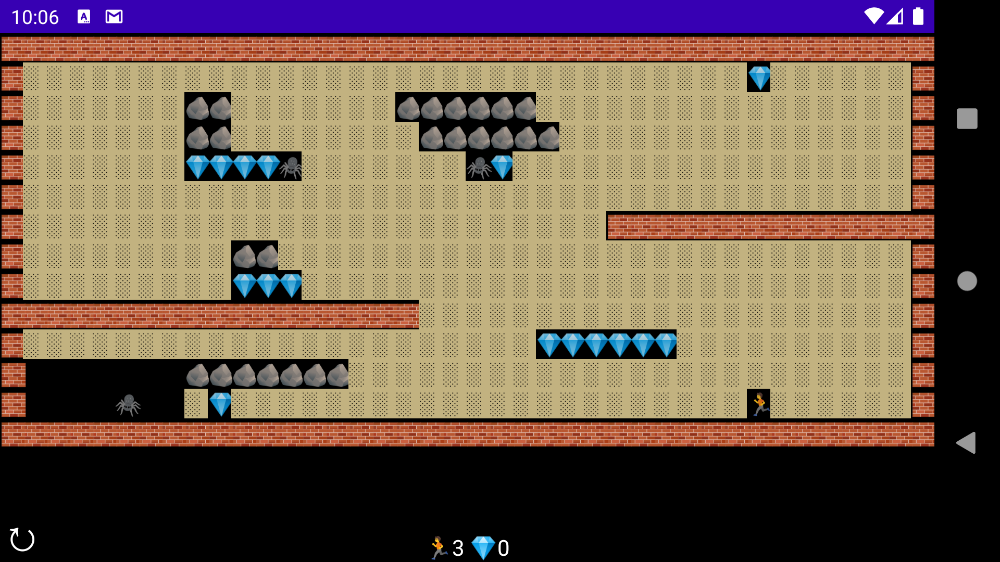

# Welcome to Compose Dash

This repo contains the source code to my three part series
[Creating a retro-style game with Jetpack Compose](https://dev.to/tkuenneth/series/13392).
The app is the prototype of a maze-like puzzle game. You control
a character who must collect gems. Be careful to not be hit by falling
rocks, gems, or bitten by spiders.

